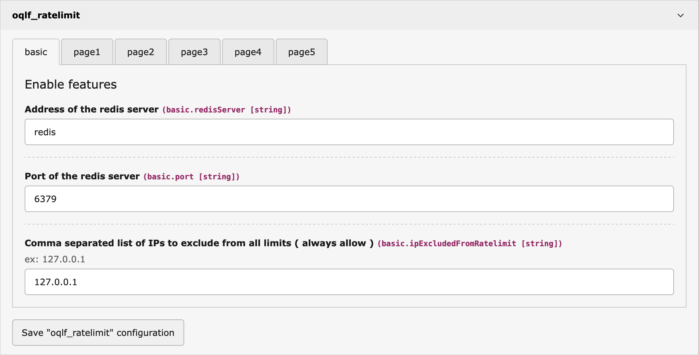

# oqlf_ratelimit

>  a Typo3 middleware to limit legitimate and illegitimate bots from hammering on computationally expensive website resources.

## What does it do?
This extension allows you to set global and per IP group limits on how many times a resource can be requested in a configurable timeframe. When this limit is reached, the clients receive a `429 Too Many Requests` and a `Retry-After:` header telling them to cool down and retry at a slower pace.

[Rate limiting with 429 Too Many Requests](https://developer.mozilla.org/en-US/docs/Glossary/Rate_limit)

## Why was this extension created?
My Typo3 website has a multi-page generated sitemap that requires a lot of database calls to produce. Search engine crawlers will request the index and then proceed to download all the pages in rapid succession, which bring my infrastructure to its knees. With oqlf_ratelimit, I set /sitemap.xml (which covers /sitemap.xml, /sitemap.xml?page=1, /sitemap.xml?page=2,..) to have a maximum of 5 calls total / 10 seconds or 3 calls in an IP group / 10 seconds. With this limit, a well-behaved search engine crawler will download the first 3 pages, then get a 429 on the next few requests. It will understand that it needs to slow down and retry at a slower pace.

It's particularly effective on Googlebot, which reacts very nicely and quickly adapts to your rules. In the case of not-so-polite search engine bots, AI learning crawlers, or even illegitimate bots, they will be limited to a few costly requests and then will only receive free-to-you empty 429 replies.

Inspired by https://www.digitalocean.com/community/tutorials/how-to-implement-php-rate-limiting-with-redis-on-ubuntu-20-04

## Configuration
All configuration is done in the Settings->Extension configuration module.

### Redis server setup

### Page limit setup
Up to 5 different limited resources can be set. Leave the path field empty if unused.

The path field will be matched against the start of the URL after the domain and the leading slash. The example below match https:∕∕www.example.com/**sitemap.xml** which will limit requests for:
- https:∕∕www.example.com/**sitemap.xml**
- https:∕∕www.example.com/**sitemap.xml**/anything
- https:∕∕www.example.com/**sitemap.xml**?page=12

## Requirements

As of now, I haven't tested on TYPO3 lower than v13, but I see no reason it wouldn't work on v12, maybe even v11 and v10. I'll update the requirements if I have returns from other users or have time to test myself sometime.

It also requires a Redis or Valkey server v7 or greater for both, which you may already be using for the Typo3 cache. In this case, you can just use the same server.
